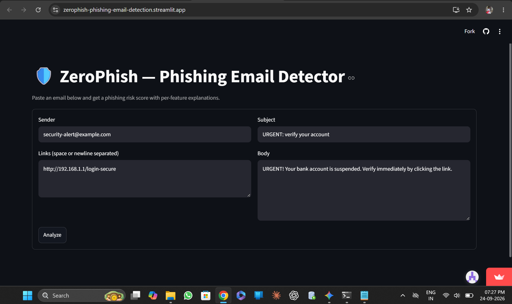
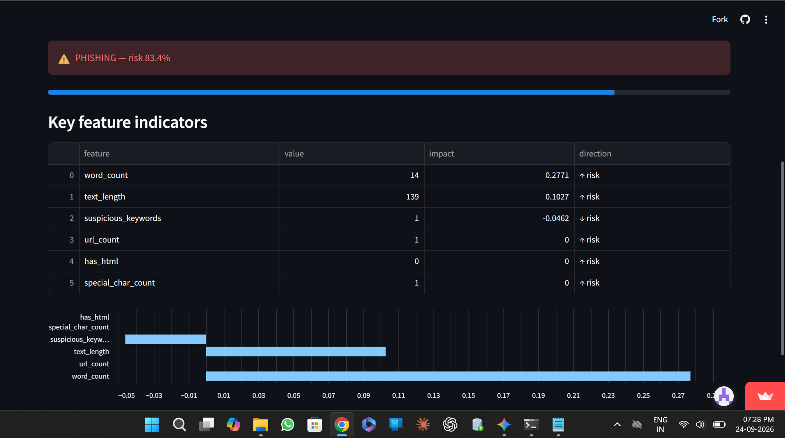

# 🛡️ Phishing Email Detector

[](https://zerophish-phishing-email-detection.streamlit.app/)

> **Live Streamlit App:** [Click here to launch app](https://zerophish-phishing-email-detection.streamlit.app/)

---

## 📌 Project Overview & Approach

* **Objective:** Classify emails as legitimate or phishing attempts using machine learning feature extraction and model prediction.
* **Approach:** Text preprocessing and feature extraction (`feature_extractor.py`) paired with a trained classification model (`phishing_model.pkl`) to identify malicious patterns and provide explanations (`predict_and_explain.py`).
* **Why this Approach?:** Feature extraction paired with lightweight ML models provides high predictive accuracy, quick inference times, and interpretable results without requiring high-compute GPU resources.

---

## 📊 Dataset
* **Dataset Used:** `phishing_email.csv`
* **Dataset Link:** [Kaggle - Phishing Email Dataset](https://www.kaggle.com/datasets/naserabdullahalam/phishing-email-dataset?select=phishing_email.csv)

---

## 🖼️ Model Demonstration

### 📹 Video Walkthrough
[]([https://drive.google.com/file/d/1la_MDsmWmBu1YfMy3MFcl7Wg_ZKfsexm/view?usp=drive_link](https://drive.google.com/file/d/1la_MDsmWmBu1YfMy3MFcl7Wg_ZKfsexm/view?usp=drive_link))

👉 **[Click here to watch the Google Drive video demo](https://drive.google.com/file/d/1la_MDsmWmBu1YfMy3MFcl7Wg_ZKfsexm/view?usp=drive_link)**

### 📷 App Screenshots
| Input Interface | Prediction & Explanation |
| :---: | :---: |
|  |  |

---

## 🛠️ Setup & Running Instructions

1. **Clone the repository:**
   ```bash
   git clone [https://github.com/jayasuruba/Phishing_emails.git](https://github.com/jayasuruba/Phishing_emails.git)
   cd Phishing_emails
   ```

2. **Create a Virtual Environment:**
   ```bash
   python -m venv venv
   ```

3. **Activate the Virtual Environment:**

   * **For Windows:**
     ```cmd
     venv\Scripts\activate
     ```

   * **For macOS / Linux:**
     ```bash
     source venv/bin/activate
     ```

4. **Install Dependencies:**
   ```bash
   pip install -r requirements.txt
   ```

5. **Run the Application:**
   ```bash
   streamlit run app.py
   ```

6. **Open the Application:**
   Open the local URL displayed in the terminal:
   `http://localhost:8501`